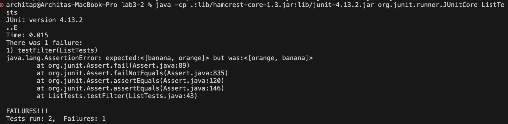

# Part 1: Bugs
1. Failure inducing input: 
```
 
@Test
    public void testFilter() {
        List<String> list = new ArrayList<>();
        list.add("apple");
        list.add("banana");
        list.add("grape");
        list.add("orange");
    
        List<String> expected = new ArrayList<>();
        expected.add("banana");
        expected.add("orange");
    
        StringChecker sc = new ListExamples();
        
        List<String> filteredList = ListExamples.filter(list, sc);
        assertEquals(expected, filteredList);
    }

```
2. Input that doesn't induce a failure

```
@Test
    public void testFilterOne() {
        List<String> list = new ArrayList<>();
  
        list.add("banana");
        list.add("cat");
        list.add("doggy");
    
        List<String> expected = new ArrayList<>();
        expected.add("banana");
    
        StringChecker sc = new ListExamples();
        
        List<String> filteredList = ListExamples.filter(list, sc);
        assertEquals(expected, filteredList);
    }

}
```
3. Running the two tests (Failure inducing input test)



4. Before fixing the bug:
```
 public boolean checkString(String s) {
    return s.length() > 5;
  }

// Returns a new list that has all the elements of the input list for which
  // the StringChecker returns true, and not the elements that return false, in
  // the same order they appeared in the input list;
  static List<String> filter(List<String> list, StringChecker sc) {
    List<String> result = new ArrayList<>();
    for(String s: list) {
      if(sc.checkString(s)) {
        result.add(0, s);
      }
    }
    return result;
  }

```

After fixing the bug
```
  public boolean checkString(String s) {
    return s.length() > 5;
  }
  // Returns a new list that has all the elements of the input list for which
  // the StringChecker returns true, and not the elements that return false, in
  // the same order they appeared in the input list;
  static List<String> filter(List<String> list, StringChecker sc) {
    List<String> result = new ArrayList<>();
    for(String s: list) {
      if(sc.checkString(s)) {
        if (result.size() == 0) {
          result.add(s);
        }
        else {
          result.add(result.size(), s);
        }
      }
    }
    return result;
  }


```
5. This fix addresses the bug because before fixing the code, the method filter() appended the elements to the resulting list to the beginning and not to the end of the list. The fixed code properly checks if the resulting list is 0 and if it is, it will add the string to the list if the StringChecker returns true for the string, and if the resutling list is not 0, it will add the string to the end of the list. This will keep same order that they appeared in the input list.

 # Part 2: Researching Commands 
 ## Option 1: find -name (search by filename pattern), Source: https://www.howtoforge.com/tutorial/linux-find-command/
 ### Example 1: 

 ```
find ./technical -name "*.txt"
```
Output: 
```
./technical/government/About_LSC/LegalServCorp_v_VelazquezSyllabus.txt
./technical/government/About_LSC/Progress_report.txt
./technical/government/About_LSC/Strategic_report.txt
./technical/government/About_LSC/Comments_on_semiannual.txt
./technical/government/About_LSC/Special_report_to_congress.txt
./technical/government/About_LSC/CONFIG_STANDARDS.txt
./technical/government/About_LSC/commission_report.txt
./technical/government/About_LSC/LegalServCorp_v_VelazquezDissent.txt
./technical/government/About_LSC/ONTARIO_LEGAL_AID_SERIES.txt
./technical/government/About_LSC/LegalServCorp_v_VelazquezOpinion.txt
./technical/government/About_LSC/diversity_priorities.txt
./technical/government/About_LSC/reporting_system.txt
./technical/government/About_LSC/State_Planning_Report.txt
./technical/government/About_LSC/Protocol_Regarding_Access.txt
./technical/government/About_LSC/ODonnell_et_al_v_LSCdecision.txt
./technical/government/About_LSC/conference_highlights.txt
./technical/government/About_LSC/State_Planning_Special_Report.txt
./technical/government/Env_Prot_Agen/multi102902.txt
./technical/government/Env_Prot_Agen/section-by-section_summary.txt
./technical/government/Env_Prot_Agen/jeffordslieberm.txt
./technical/government/Env_Prot_Agen/final.txt
./technical/government/Env_Prot_Agen/ctf7-10.txt
./technical/government/Env_Prot_Agen/ctf1-6.txt
./technical/government/Env_Prot_Agen/ro_clear_skies_book.txt
./technical/government/Env_Prot_Agen/ctm4-10.txt
./technical/government/Env_Prot_Agen/1-3_meth_901.txt
./technical/government/Env_Prot_Agen/atx1-6.txt
./technical/government/Env_Prot_Agen/tech_sectiong.txt
./technical/government/Env_Prot_Agen/bill.txt
./technical/government/Env_Prot_Agen/nov1.txt
....
```
....more .txt files
This command searches for files within the ./technical directory and its subdirectories with the .txt extension.

### Example 2

```
find ./technical -type d -name "biomed*"
```

Output
```
./technical/biomed
```
This command searches for directories within the ./technical directory with names starting with "biomed".

## Option 2: find --not (display names that don’t match search pattern), Source: https://www.howtoforge.com/tutorial/linux-find-command/
### Example 3

```
find ./technical -not -name "*.txt"
```

Output
```
./technical
./technical/government
./technical/government/About_LSC
./technical/government/Env_Prot_Agen
./technical/government/Alcohol_Problems
./technical/government/Gen_Account_Office
./technical/government/Post_Rate_Comm
./technical/government/Media
./technical/plos
./technical/biomed
./technical/911report

```

This command prints the file names that do not match the search pattern. In this case, we want to find all the files and directories that do not have a .txt extension


### Example 4

```
find ./technical -type d -not -name "biomed*"
```

Output 
```
./technical
./technical/government
./technical/government/About_LSC
./technical/government/Env_Prot_Agen
./technical/government/Alcohol_Problems
./technical/government/Gen_Account_Office
./technical/government/Post_Rate_Comm
./technical/government/Media
./technical/plos
./technical/911report
```
This command prints the directories that do not match the search pattern. In this case, we want to find all the directories that do not match the pattern "biomed*".

## Option 3: find -size (search files by size), Source: https://www.howtoforge.com/tutorial/linux-find-command/
### Example 5

```
find ./technical -type f -size -1k
```

Output
```
./technical/plos/pmed.0020191.txt
./technical/plos/pmed.0020226.txt
```
This command search files by size, and in this case, this command will search for files within the ./technical directory and its subdirectories that are smaller than 1 megabyte. 

### Example 6
```
find ./technical -type f -size +170k
```
Output

```
./technical/government/About_LSC/commission_report.txt
./technical/government/Env_Prot_Agen/multi102902.txt
./technical/government/Env_Prot_Agen/bill.txt
./technical/government/Env_Prot_Agen/tech_adden.txt
./technical/government/Gen_Account_Office/GovernmentAuditingStandards_yb2002ed.txt
./technical/government/Gen_Account_Office/Statements_Feb28-1997_volume.txt
./technical/government/Gen_Account_Office/pe1019.txt
./technical/government/Gen_Account_Office/d01591sp.txt
./technical/911report/chapter-13.4.txt
./technical/911report/chapter-13.5.txt
./technical/911report/chapter-3.txt
```
This command searches for files within the ./technical directory and its subdirectories that are larger than 170 megabytes. 

## Option 4: find -maxdepth (limit listing results), Source: https://www.howtoforge.com/tutorial/linux-find-command/
### Example 7

```
find ./technical -maxdepth 1 -type d
```

Output
```
./technical
./technical/government
./technical/plos
./technical/biomed
./technical/911report
```


### Example 8

```
find ./technical -maxdepth 1 -type f
```
The command find searches for directories directly within the ./technical directory, up to a maximum depth of 1 level. 

Output
```
./technical/.DS_Store
```
The command find ./technical -maxdepth 1 -type d searches for files directly within the ./technical directory, up to a maximum depth of 1 level. 

