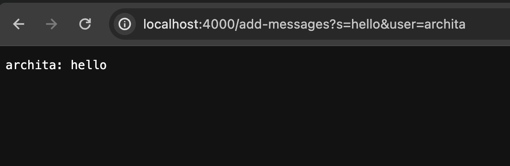
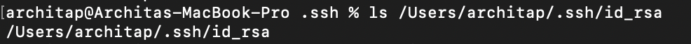

# Lab 3
## Part 1
### Web Server Code

```
import java.io.IOException;
import java.net.URI;
import java.util.ArrayList;
import java.util.List;

class Handler implements URLHandler {

    List<String> messages = new ArrayList<>();

    public String handleRequest(URI url) {
       
  
            if (url.getPath().contains("/add-message")) {
                String urlS = url.toString();
                String message = "";
                String user = "";

                if (url.getQuery().contains("s=")) {
                    message = urlS.split("s=")[1];
                    message = message.split("&")[0];
                }

                if (url.getQuery().contains("user=")) {
                    user = urlS.split("user=")[1];
                }

                String resultMessage = String.format("%s: %s", user, message);
                messages.add(resultMessage);

                return String.join("\n", messages);
            }
            return "404 Not Found!";
        
    }
}

class NumberServer {
    public static void main(String[] args) throws IOException {
        if (args.length == 0) {
            System.out.println("Missing port number. For the first argument (port number), try any number between 1024 to 49151.");
            return;
        }


        int port = Integer.parseInt(args[0]);

        Server.start(port, new Handler());
    }
}

```
### Examples Messages using /add



For this example, the handleRequest method is called with http://localhost:4000/add-messages?s=hello&user=archita being the argument passed to this method. As the lines of code in this method get executed, the value of messages is set to whatever is in front of the s= portion of the url which in this case is "hello", the value of the urlS variable is set to the current url that was passed (http://localhost:4000/add-messages?s=hello&user=archita), and the value of the user variable is set to whatever is after user= in the url which in this case is archita. The String.join("\n", messages) line formats the user and messages argument appropriately by adding one line in between each new message addition. 


For this example, the handleRequest method is again called with http://localhost:4000/add-messages?s=i%20like%20food&user=anushka being the argument passed to this method. As the lines of code in this method get executed, the value of messages is set to whatever is in front of the s= portion of the url which in this case is "amazing", the value of the urlS variable is set to the current url that was passed (http://localhost:4000/add-messages?s=i%20like%20food&user=anushka), and the value of the user variable is set to whatever is after user= in the url which in this case is anushka. The String.join("\n", messages) line formats the user and messages argument appropriately by adding one line in between each new message addition. 

## Part 2
### 1. ls with Absolute path to the private key


### 2. ls with Absolute path to the private key


### 3. No Password needed


## Part 3
### I learned how we can login to the remote server without needing a password as well as how we can properly move files from our remote server to our local computer. I think it's really helpful to be able to move files from our remote server to our local computer because opying files locally enables collaboration by allowing multiple users to work on the same files simultaneously. 

    

