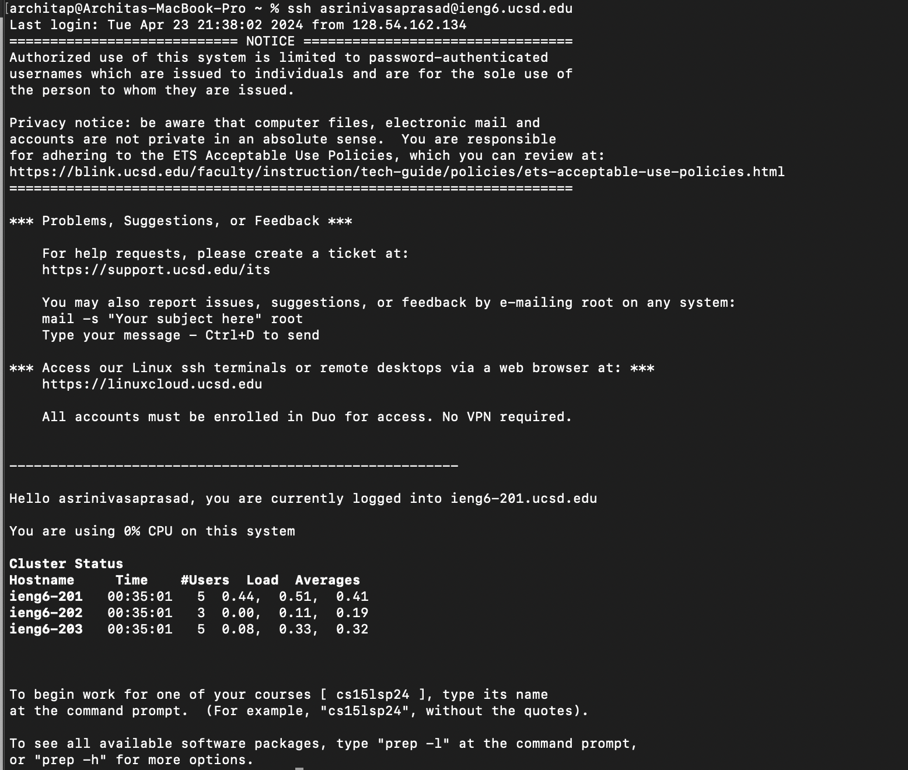
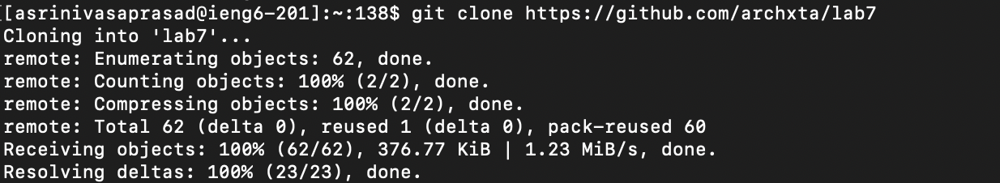
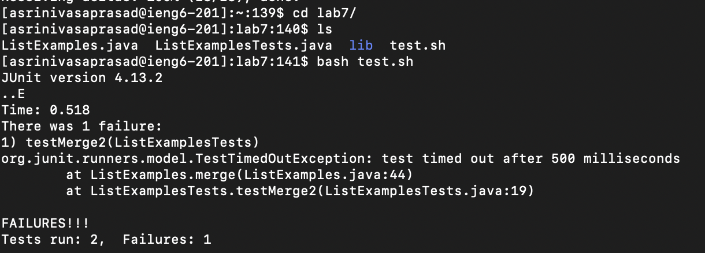
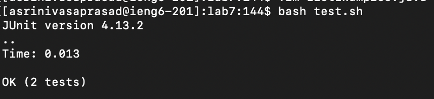
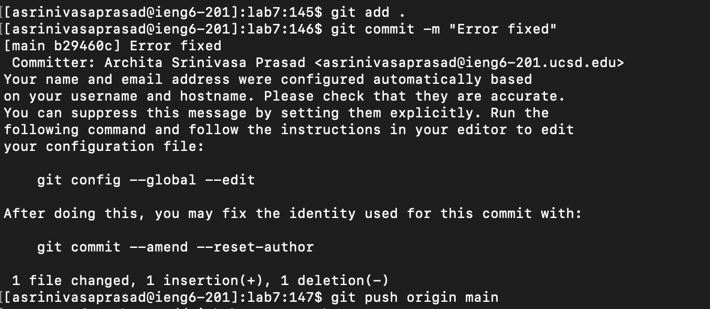

# Lab 4

## Step 1: Log into ieng6


``` ssh asrinivasaprasad@ieng6.ucsd.edu ```

To log onto the ieng6 server, I did ``` ssh asrinivasaprasad@ieng6.ucsd.edu ```

## Step 2: Cloning the repository

``` git<space>clone<space>https://github.com/archxta/lab7<enter>```

To fork the repository, I copied the link to the github and did ``` git<space>clone<space>https://github.com/archxta/lab7<enter>``` in the commmand line. This command cloned the forked repository to my current directory. 

## Step 3: Run the tests, demonstrating that they fail

``` cd<space>lab7<enter>ls<enter>bash<space>test.sh<enter> ```

To run the tests, I first had to change directories, so I did ``` cd<space>lab7<enter> ``` and then did ``` ls<enter>``` to check the contents in the directory. I then did ``` bashs<space>test.sh<enter>``` to run the test script in order to demonstrate that the tests failed.

## Step 4: Edit the code file to fix the failing test

``` vim ListExamples.java ``` ``` <shift>g<up><up><up><up><up><up><right><right><right><right><right><right><right><right><right><right><right>2<right><delete><esc>:wq<enter>```

To edit the code file, I did ``` vim ListExamples.java ``` and then pressed ```i``` to go into insert mode. I then did ``` <shift> g ``` to go to the end of the file followed by ```<up><up><up><up><up><up><right><right><right><right><right><right><right><right><right><right><right> ``` to go to the correct character that I needed to replace. I had to replace ```index1``` to ```index2``` and this was 11 spaces away from the right. I then clicked ```2``` to change the ```1``` to a ```2``` and did ```<right>``` and  ```<delete>``` to the delete the ```1```. To go out of insert mode, I pressed ```<esc>```, and to save and exit the file I did ```:wq<enter>```. 

## Step 5: Run the tests, demonstrating that they now succeed

```bash test.sh<enter>```

To run the tests again, I did ```bash test.sh<enter>```.

## Step 6: Commit and push the resulting change to your Github account

 ``` git<space>add<space>.<enter>git<space>commmit<space>-m<space"Error Fixed"<enter>git<space>push<enter>```

To push this change to my github account, I did ``` git<space>add<space>.<enter>``` to add all changes in the current directory to the already existing directory in Github. I then did ``` git<space>commmit<space>-m<space"Error Fixed"<enter>``` to commit these changes to the repository. Finally, I did ``` git<space>push<enter>``` to push these changes so they actually appear on Github. 

   

