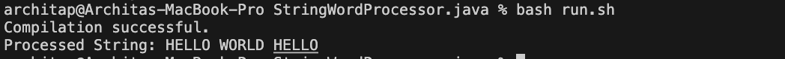
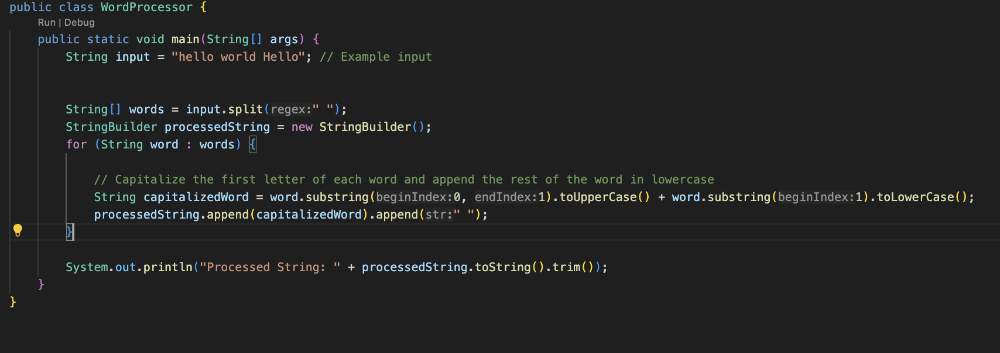
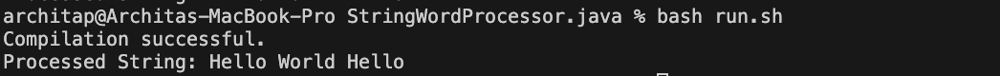
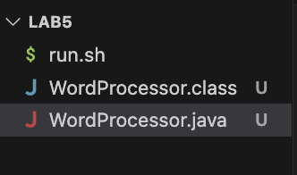
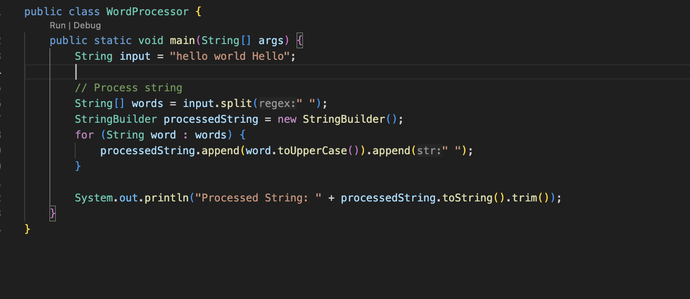
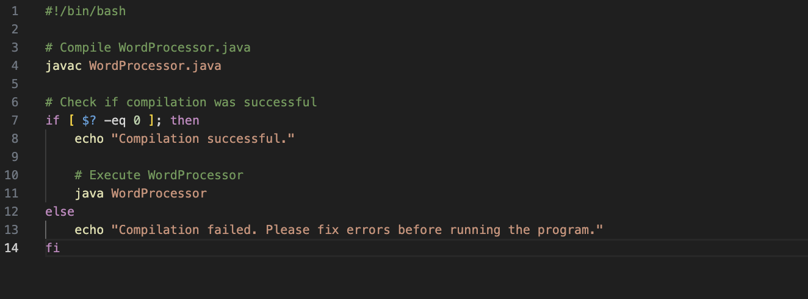

# Lab 5

## Part 1
## Original post from student 

I'm working on a program to process a list of words, but I'm encountering unexpected behavior. The program is supposed to capitalize the first letter of each word in the list, but for some words, it's not working correctly. Instead of capitalizing the first letter, it's converting the entire word to uppercase. I suspect there's a bug in my string processing logic. Attached below is a screenshot illustrating the problem.

## TA Response

Hi! I can see that your program encounters an issue with capitalizing the first letter of each word. Have you checked how you're splitting the input string into words? It seems like the program is treating each word as a separate string instead of processing the entire input string. I recommend examining your string splitting logic to ensure it correctly separates words based on whitespace characters. Let me know if that works!

## Information student got
Thank you for your response! I just looked over the code and I realized I need to adjust the logic inside the loop to capitalize only the first letter of each word while keeping the rest of the word in lowercase. To fix the bug, I used substring(0, 1).toUpperCase() to capitalize only the first letter of each word and substring(1).toLowerCase() to convert the rest of the word to lowercase to ensure that each word in the output string has its first letter capitalized while keeping the rest of the word in lowercase. 

 
 

## All information about setup

### File & directory structure needed

### The contents of each file before fixing the bug

### Java file with the main code
 

### Bash Script

### Full command line to trigger the bug

### Description of what to edit to fix the bug
To fix the bug, I adjusted the logic inside the loop responsible for processing each word in the input string. Instead of applying the toUpperCase() method to the entire word, I split the word into two parts: the first letter and the rest of the word. I used the substring(0, 1).toUpperCase() method to capitalize only the first letter of each word so that only the first letter is converted to uppercase, and then I used the substring(1).toLowerCase() method to convert the rest of the word to lowercase so that the rest of the word remains unchanged in case some letters were accidentally capatilzed in the input word. 

## Part 2

Something I learned from my lab experience in the second half of the quarter is how to execute commands and code solely from the command line using vim. I never really knew what vim was before they introduced it in this class, and I really think vim is a helpful tool that allows programmers to quickly edit code from the command line itself instead of having to open up the file in a code editor. I really like how vim is easy to use because it has a lot of keyboard shortcuts and allows the programmer to manipulate the code in a very efficient way. 

